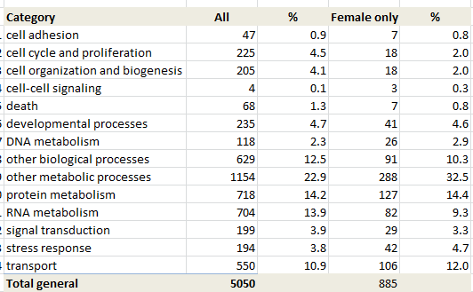
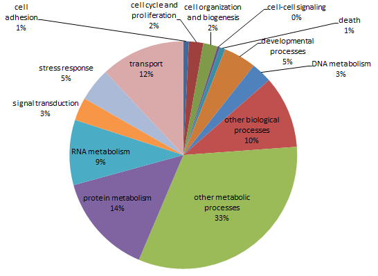
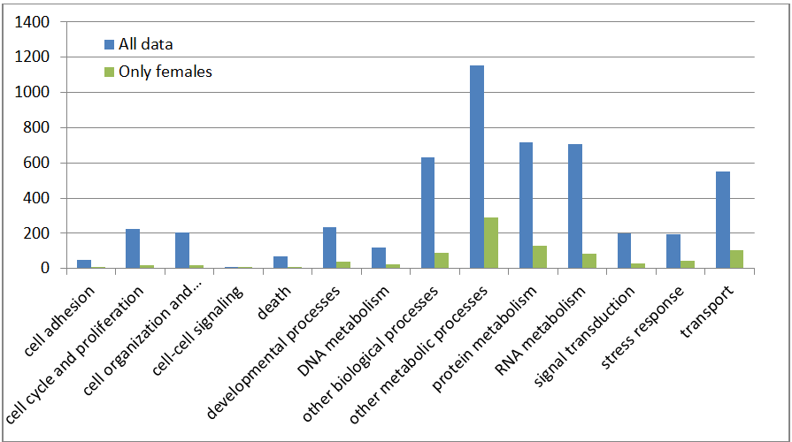
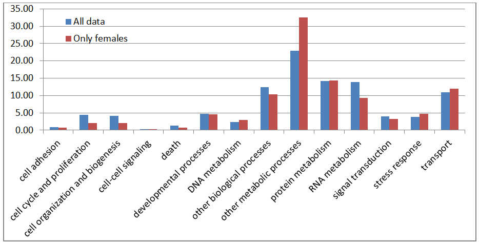
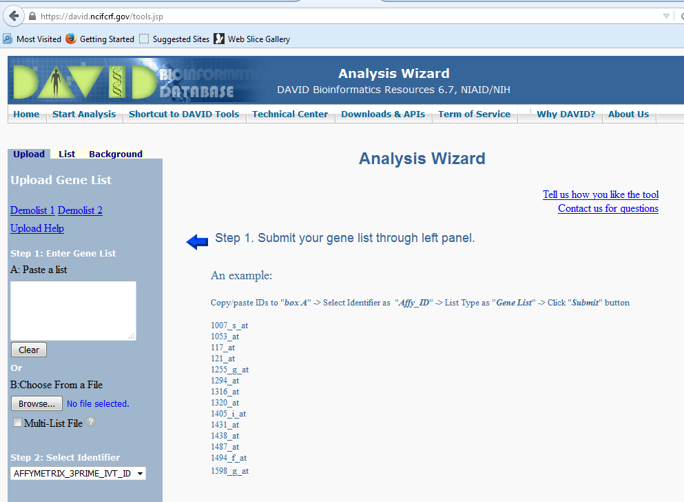

# DAY 4: LOOKING FOR SEX-SPECIFIC GENES
## by Fabiola Lafarga

### We are analizing what genes are expressed in female and not in males of geoduck.
---
1.- Do blastn between females and males files.

2.- Do annotation of female fasta file using Unioprot database (swiss prot) as reference with blastx.

3.- Then make one file from the output files of process 1 and 2 following  the instructions 
[here](https://github.com/sr320/course-btea/blob/master/day-4/00-sex-specific.ipynb)

From this [web-page](https://github.com/sr320/course-btea/tree/master/analyses) download the resulting file named `GeoF-Annotation-SP-join-F-M-match.csv´

 

### Open this file at excel and create some graphs
1.	After deleting the redundant data (repeat contigs) we end with 5050 genes.
2.	After eliminate the ones expressed in both sexes, we end up with 885 genes (lines).

## Graph of all data

## Graph of only female genes

### Comparing both data

## Using all data numbers in each category

## Using the percentage in each category
 

# Then go to DAVID and REVIGO and do more fun stuff

SPID full transcriptome is use as BACGROUND and SPID female transcriptome as GENE LIST using DAVID 
[web-page](https://david.ncifcrf.gov/) 

And this will give us the GO-BP-FAT [chart](https://david.ncifcrf.gov/data/download/chart_0F10A3308C2F1445623512074.txt). 

Then download this file and go back to excel or REVIGO [web page](https://revigo.irb.hr/) to visualize the interesting resulting data we generate today.

### Sorry I couldn´t make it, REVIGO web page is not working !!!!!